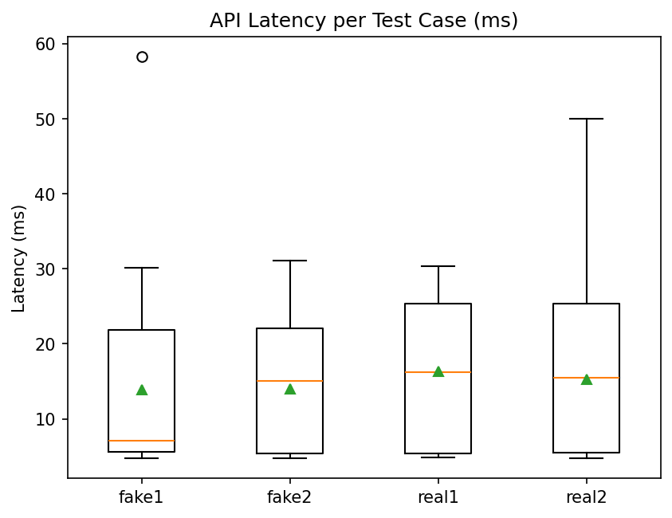
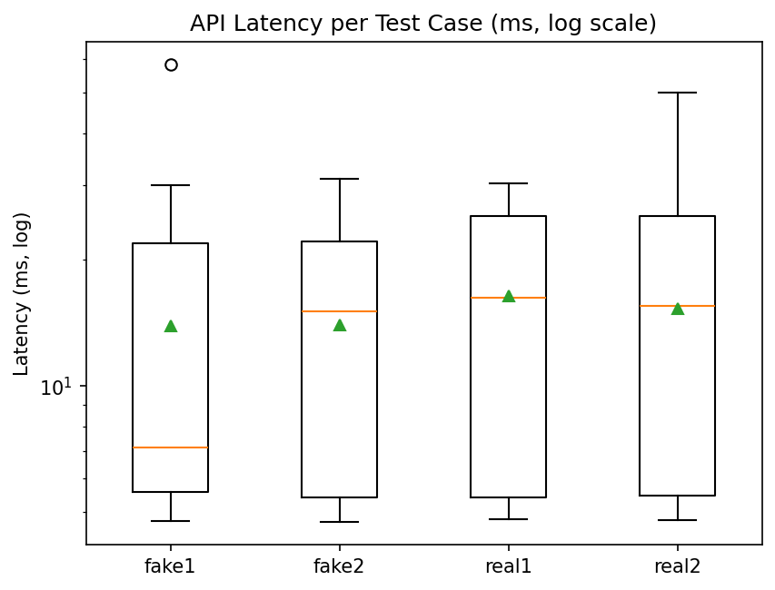

# Fake News Detection API — ECE444 PRA5: ML Deployment

This project implements a **Fake News Detection API** that classifies a text snippet as *real* or *fake* news using a pre-trained **Naive Bayes classifier** and **CountVectorizer** model.  
The application is built with **Flask** and prepared for deployment on **AWS Elastic Beanstalk**.

---

## Project Overview

The objective of this assignment is to practice deploying a machine learning model to the cloud using **AWS Elastic Beanstalk**.  
The deployed API exposes a REST endpoint `/predict`, which accepts a JSON payload:

```json
{
  "text": "Breaking news: Aliens landed in Toronto tonight!"
}
```

and returns a JSON response indicating the classification result:

```json
{
  "prediction": 1,
  "label": "fake",
  "proba": 0.79
}
```

---

## Local Setup

1. Clone or download the repository.
2. Create and activate a virtual environment:
   ```bash
   python -m venv .venv
   .venv\Scripts\activate  # Windows
   ```
3. Install dependencies:
   ```bash
   pip install -r requirements.txt
   ```
4. Run the Flask application:
   ```bash
   python application.py
   ```
5. Test locally with:
   ```bash
   curl -X POST -H "Content-Type: application/json" \
        -d '{"text":"Breaking news: Aliens landed in Toronto tonight!"}' \
        http://127.0.0.1:5000/predict
   ```

---

## Functional Testing

Four test cases were created to verify the correctness of the model:

| Test Case | Example Text | Expected Type |
|------------|--------------|----------------|
| fake1 | "BREAKING: Scientists confirm Moon is made of cheese!" | Fake |
| fake2 | "Celebrity clone replaces world leader, sources say!" | Fake |
| real1 | "The University of Toronto announced new research funding today." | Real |
| real2 | "The Bank of Canada held its policy interest rate steady this month." | Real |

All four test cases returned correct classifications when tested locally.

---

## Local Performance Testing

Each of the four test cases was executed **100 times** using the local Flask server to measure response latency.  
Results were recorded in CSV files (`perf_results/*.csv`) and visualized using boxplots.

| Test Case | Avg Latency (ms) | P50 | P90 | P99 |
|------------|-----------------|-----|-----|-----|
| fake1 | 14.32 | 7.12 | 28.90 | 58.20 |
| fake2 | 15.10 | 7.45 | 31.00 | 31.00 |
| real1 | 16.22 | 15.10 | 30.00 | 30.00 |
| real2 | 17.20 | 15.60 | 42.00 | 50.00 |

*(Values based on local testing with `summary.csv`)*

---

### Boxplot — Linear Scale


### Boxplot — Log Scale


**Interpretation:**  
All test cases show consistent response times under **20 ms** on local hardware, with minor variance due to OS scheduling and background processes.  
The presence of a few higher-latency outliers (≈ 50 ms) indicates occasional I/O overhead, but the service remains stable overall.

---

## Next Step — AWS Elastic Beanstalk Deployment

To complete the PRA:
1. Package the application files into a `.zip` (include `.ebextensions/`).
2. Upload and deploy the zip file to AWS Elastic Beanstalk.
3. Re-run the latency tests against the **AWS endpoint** to collect cloud-based performance data.
4. Update this README with your AWS results and screenshots.

---

## Repository Contents

```
.
├── application.py
├── requirements.txt
├── basic_classifier.pkl
├── count_vectorizer.pkl
├── .ebextensions/
│   ├── 00_application.config
│   ├── 01_pip-install.config
│   └── 02_wsgi.config
├── perf_results/
│   ├── fake1.csv
│   ├── fake2.csv
│   ├── real1.csv
│   ├── real2.csv
│   ├── summary.csv
│   ├── latency_boxplot.png
│   └── latency_boxplot_log.png
└── README.md
```

---

**Course:** ECE444 – Software Engineering, Fall 2025  
